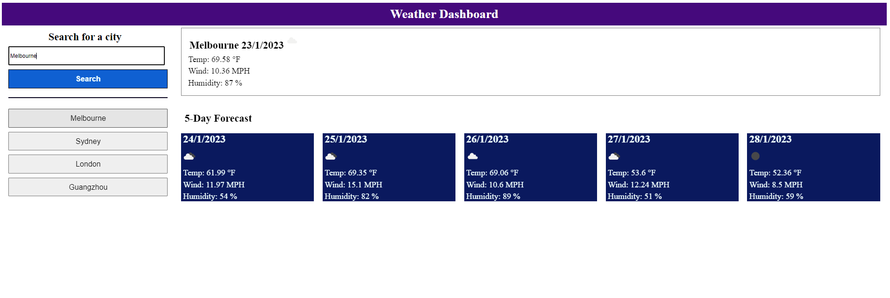

# Weather-Dashboard
## Description
The weather dashboard allow user to check the weather data for cities and with 5 days forecast weather condition. The weather data is from openweathermap. The website will load the previous search history from the local storage. The lastest search will go to the top of the history list. The history will not store duplicated city. Clicking the city in the history list will provide the current and future conditions for the city.

## Mock-UP

## Service-side API

Open Weather
https://openweathermap.org/api

## Link
https://houchenghao.github.io/Weather-Dashboard/
